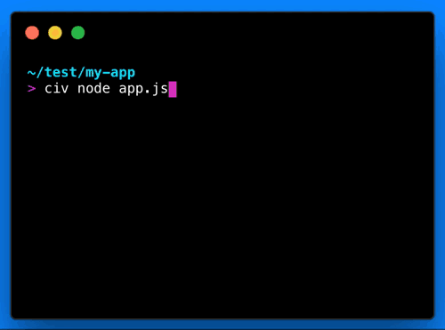

# civ
> Search stdout server logs in realtime

```sh
npm install --global civ
```

[](https://www.npmjs.com/package/civ)



## Usage

```sh
civ my-program
```

## About

[Twelve Factor: Logs](https://12factor.net/logs) recommends to write all logs from
an application to `stdout`, leaving some supervisor to manage the
legwork of persisting it, using it for reporting, and what not. I love this
because it means I have an excuse to make fewer decisions inside my app.

The problem is logs are noisy. Some apps write straight away to a file to get at
least the insignificant logs out of the way. For long running programs the
`stdout` becomes a mess and hard to follow, search, and debug.

`civ` is for developers working locally on applications that spew to `stdout`. Search logs as they stream in and on exit `civ` writes the logs to `stdout` like normal.
